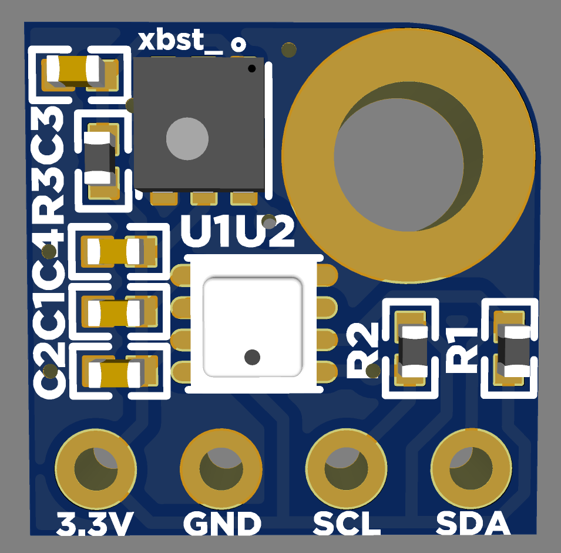

# BME280 & SGP40 Sensor PCB for Nevermore Air Filters

A compact PCB with SGP40 and BME280 sensors wired in I2C mode and powered with 3.3V.

## Purchasing a PCB
### United States
- [Amazon - Prime Shipping](https://www.amazon.com/dp/B0CGKHSLXH)
- [Isik's Tech Store](https://store.isiks.tech/products/bme280-sgp40-air-quality-sensors-for-nevermore-air-filters) (Me)
- [eBay](https://www.ebay.com/itm/155719560222)
### European Union
- [Lab4450 - Portugal](https://lab4450.com/product/air-quality-sensor-bme280-sgp40/)

This project is licensed under [GPL v3](./LICENSE), meaning vendors are allowed to sell PCBs without paying me. If you'd like to support the development of this and future projects please consider [sponsoring](https://github.com/sponsors/xbst) me on GitHub. You can also subscribe on [Patreon](https://l.isiks.tech/patreon) or [YouTube](https://l.isiks.tech/member).

You can also use the included gerber files to order your own from a PCB manufacturer like [PCBWay](https://www.pcbway.com/setinvite.aspx?inviteid=374841).
 

## YouTube

I am a YouTube content creator. If you want content about these projects & more, please consider [subscribing to my YouTube channel](https://www.youtube.com/channel/UClAWYmCkHjsbaX9Wz1df2mg).
 

If you feel like contributing to the development of this project and other projects like this you can sponsor me on [GitHub](https://github.com/sponsors/xbst), subscribe on [Patreon](https://l.isiks.tech/patreon) or [YouTube](https://l.isiks.tech/member).

## Notes
- Readme files in this repo may contain Amazon Associate, Aliexpress affiliate, PCBWay affiliate links. I make a comission on qualifying purchases.
- This project does not come with any warranty, if you choose to build/use a PCB manufactured using published files in this repository, you are doing this at your own risk!
- If you want to sell PCBs manufactured using published files in this repository, you are allowed to, and you will not owe me any royalties. **You cannot claim that I endorse the sale**. You can check the license file for more information. However, if you **wish** to give me a share you can sponsor me on [GitHub](https://github.com/sponsors/xbst), subscribe on [Patreon](https://l.isiks.tech/patreon) or [YouTube](https://l.isiks.tech/member).
